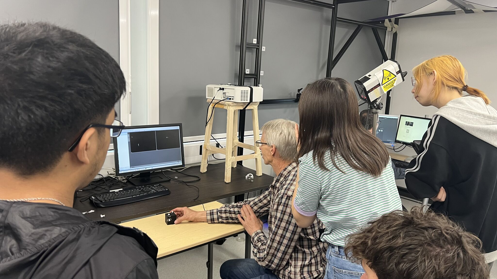

### Project Overview
In June 2024, I played an integral role in preparing and delivering a hands-on **Motion Capture course**, a key collaboration between the University of Birmingham's **VR Lab** and the **I-Move** research groups. The intensive course was designed to equip university staff and students with the foundational skills needed to use our motion capture system for research.

### My Role and Responsibilities
As a guide and instructor, my primary responsibility was to bridge the gap between theoretical knowledge and practical application. I was actively involved in teaching the participants the end-to-end workflow for a successful motion capture session.

My key responsibilities included:
* **System Setup:** Guiding attendees through the process of setting up the motion capture system's hardware and software.
* **Calibration Techniques:** Demonstrating the crucial steps for accurate system calibration, a vital step for collecting reliable data.
* **Data Collection Best Practices:** Leading practical sessions where we collected small samples of data, emphasising techniques and methods to ensure the highest quality data capture possible.

By the end of the course, all participants had gained the practical knowledge and confidence needed to begin incorporating motion capture into their own research projects.

You can see below is my assigned group where they were challenged to see what they can remember in starting the system to collecting data, whiles also being asked many questions on how the system operates:

