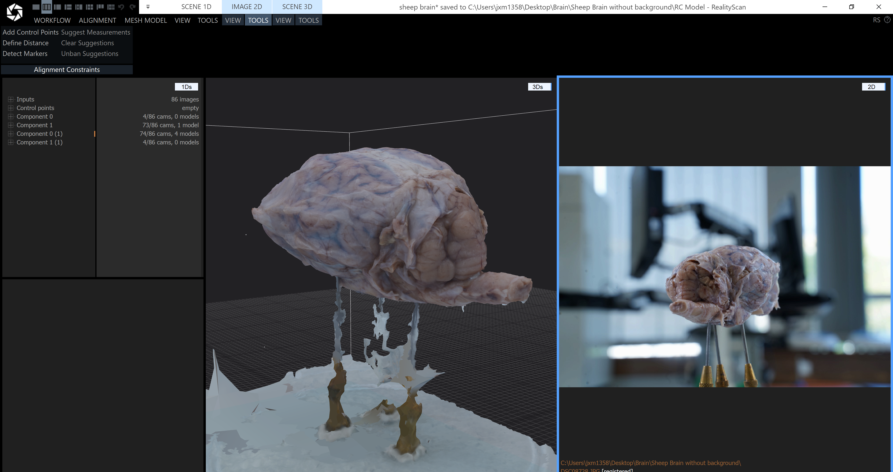

> **Content Warning:** This project involves detailed 3D models of an animal dissection for educational and scientific purposes.

As part of my Summer 2025 EdTech Internship with the **Collaborative Teaching Laboratory (CTL)**, the interns are tasked to developing a digital tool to supplement the traditional mouse dissection practical for students at the University of Birmingham.

### Project Overview

Dissections are a cornerstone of anatomical education, but textbooks often present body systems in simplified, 2D views that don't capture the true spatial complexity. The objective of this project is to create an intuitive 3D learning tool in Unity that enables students to explore the body systems of a mammalian animal in a detailed, interactive way.

The goal is to provide students with a step-by-step virtual dissection experience that enhances their understanding before or after a physical lab practical.

To further understand the organs, we implemented a small interface where the student is able to see detailed explaination of the functionalities of the organs if they so wish or view it in detail:

### Student Learning Objectives
* To recognise the basic anatomy of a mammalian host.
* To explore the 3D view and spatial relationships of different body systems.
* To virtually use dissection tools to explore basic anatomy in a repeatable environment.

### My Role and Technical Process
My primary responsibility on this project has been leading the 3D asset creation pipeline and providing project management. This has involved:

* **Leading Photogrammetry Efforts:** I lead the process of using photogrammetry—taking hundreds of high-resolution pictures from every angle—to generate realistic 3D models of the mouse and its individual organs. Here, we have utilised the tool 'Reality Scan' as our main tool to develop the base models for the project before using 'Blender' to refine the models and make them suitable for the project
* **Research and Development:** We experimented with different setups and technologies, including an attempt to utilise a 3D scanner, to determine the most effective method for our specific needs.
* **Technical Problem-Solving:** A significant part of my role was figuring out ways to mitigate common 3D capture issues, such as managing reflections on tissue, capturing fine details, and accurately modelling very small objects.
* **Project Management and Guidance:** I have been responsible for managing the project's direction and providing guidance to the other interns to ensure we meet our development goals.

Below is an example of a set-up we tried to use for the day we do the dissection, this is one of many attempts but this one was the closest we got:

### Current Status (As of August 2025)
We have successfully developed a first version of the interactive tool with numerous amount of feedback from the leading academic. This build allows a student to freely rotate and view a complete 3D model of a mouse and explore its various dissection stages. Our work continues as we refine the models and enhance the tool's interactivity ahead of the project's conclusion in September.

Overall, this project has been a challenge but still quite enjoyable as we try and employ different methods to see how we could capture small intricate details on the surface of the organs. We worried that Reality Scan would have trouble with the images that we have, as they are not zoomed in quite enough, but in the end we managed to produce good quality models. You can see a quick test we did from an entire sheep's brain before a small small section below:

