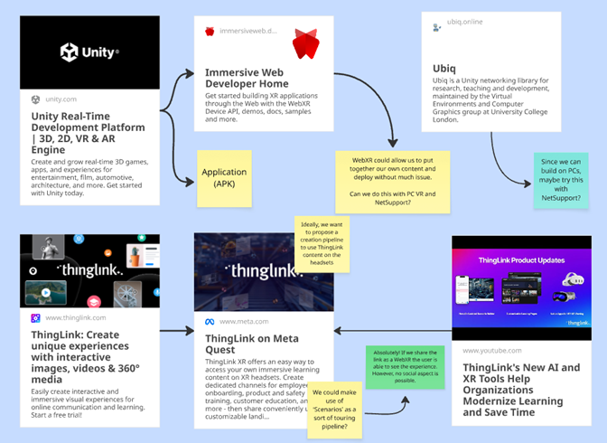
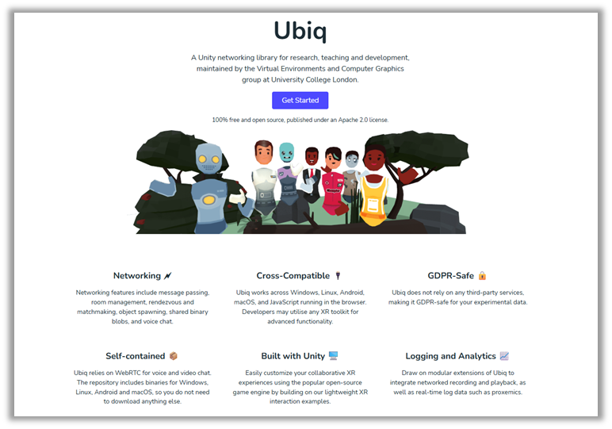
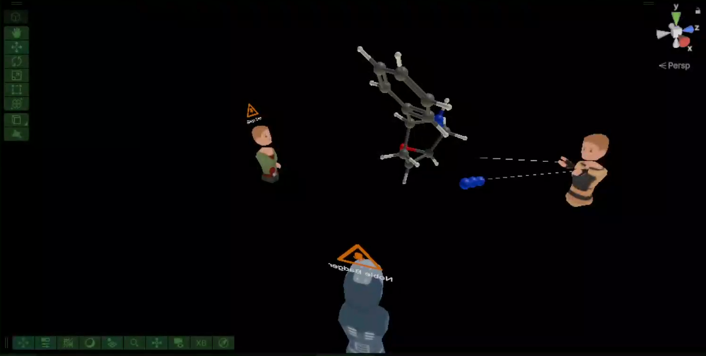

### Project Overview
As part of my internship with the **Collaborative Teaching Laboratory (CTL)**, I was tasked with a critical project: redesigning the framework for how we deploy Virtual Reality in education. While the CTL has successfully used VR for instructor-led, small-group teaching, the existing methods were not built to scale.

As the deployment of VR scales from small groups to larger class sizes, the logistical and cognitive load on the instructor increases exponentially. This project's motivation was to develop a scalable and user-friendly framework that allows academics to seamlessly integrate VR into their curricula, ensuring the focus remains on pedagogy, not technological troubleshooting.

The project is built on three core pillars:
1.  **Headset Management and Infrastructure**
2.  **VR-Enabled Teaching Models**
3.  **A Streamlined Content Pipeline**

This post details the foundational work completed for the first pillar: creating a robust management infrastructure.

### The Challenge: Scaling from 10 to 30+ Headsets
The previous method of managing headsets with shared user accounts was adequate for a small fleet. However, with the lab's expansion to over 30 headsets, this system became untenable. Key challenges included:
* **Time-Consuming Setups:** Manually updating apps and system software on each device individually.
* **Inconsistency:** Ensuring every headset had the correct content and configuration for a given session.
* **Technical Limitations:** Running into Meta's two-headset limit for shared accounts on a single Wi-Fi network.

### The Solution: A Mobile Device Management (MDM) Framework
After researching alternatives, it was clear that a **Mobile Device Management (MDM)** solution was the only viable path forward for remote, at-scale management.

My research and implementation process involved:
1.  **Evaluating the New Landscape:** I discovered that a recent change—the introduction of **Meta Horizon Managed Service (HMS) in February 2025**—had fundamentally altered the ecosystem. All third-party MDMs now require devices to first be enrolled in HMS. This was a critical finding that shaped our entire strategy.
2.  **Comparative Analysis:** I conducted trials of two leading MDM platforms, **ManageXR** and **ArborXR**. Both offered the core functionality we needed, including remote content deployment, device configuration, and fleet monitoring.
3.  **Strategic Recommendation:** I recommended **ArborXR** as the CTL's chosen platform. While both were excellent, ArborXR provided the same essential feature set at a more cost-effective price point, making it the ideal choice for our use case.
4.  **Developing a Standard Operating Procedure (SOP):** I created and documented a clear, step-by-step process for enrolling the entire fleet of headsets into the new HMS + ArborXR framework. This guide ensures that any team member can reliably provision new devices in the future.

### The Outcome: A Centralised, Scalable System

The new framework provides a robust foundation for all future VR teaching at the CTL. Key capabilities include:
* **Centralised Fleet Management:** We can now remotely push system updates, configure settings, and monitor the status (battery, connectivity) of all 32 headsets from a single web dashboard.
* **Effortless Content Deployment:** We can assign specific applications to groups of headsets, ensuring every student has the right experience for their lesson with a few clicks.
* **Simplified Asset Tracking:** I proposed a revised, more intuitive physical labeling convention (`CTL-(Model)(Number)`) to make identifying headsets during a busy session much easier.

This foundational work dramatically reduces the setup time and technical burden on instructors, making large-scale VR sessions not just possible, but practical. The next steps of this project will involve building new teaching models on top of this reliable infrastructure.

### A Streamlined Content Pipeline

With a robust MDM framework established, the focus shifts from device logistics to pedagogical impact. The choice of an MDM like ArborXR was not just about managing hardware; it was about creating a flexible and powerful pipeline for deploying diverse educational content. This pipeline is designed to support a spectrum of teaching needs, from simple, ready-made experiences to highly bespoke, collaborative virtual labs.

#### Empowering Academics with Diverse Content Types

Our new infrastructure simplifies the deployment of various content formats, each serving a different pedagogical purpose. We can seamlessly push any of the following to the entire fleet:
* **Immersive Media:** 360-degree videos and images for virtual field trips or situational training.
* **Web-Based Content:** WebXR links that provide access to a growing ecosystem of browser-based VR experiences without needing to install a full application.
* **Third-Party Applications:** Vetted educational apps from the Meta Quest Store.
* **In-House Applications (APKs):** Custom-built Unity or Unreal Engine applications designed specifically for CTL's academic partners.

While all are valuable, the ability to develop and deploy our own **in-house APKs** is the most transformative aspect of this new framework. It allows us to move beyond off-the-shelf software and create experiences tailored precisely to the curriculum, ensuring that the technology serves the teaching, not the other way around.

#### A New Model for Collaborative Learning: Social VR

To maximise the potential of in-house development, we are focusing on **Social VR** as a core pillar of our content strategy. Traditional single-player VR can be isolating, but Social VR transforms it into a shared, interactive space for collaborative learning.

After consulting with the in-campus academic, we have adopted **[Ubiq](https://ubiq.online/)**, a powerful open-source networking library for Unity. Ubiq enables us to efficiently build multi-user environments where students and instructors can interact with each other and with virtual objects in real-time. This approach unlocks several powerful teaching models:

* **Virtual Demonstrations:** An instructor can lead a class of students through a virtual demonstration of a complex piece of equipment, a surgical procedure, or a chemical reaction that would be too dangerous, expensive, or impractical to replicate in a physical lab.
* **Collaborative Problem-Solving:** Students can gather in a virtual space to collectively assemble a model, analyse data visualisations, or solve spatial puzzles, fostering teamwork and peer-to-peer learning.
* **Enhanced Social Presence:** By seeing and hearing their peers and instructor as avatars, students feel a greater sense of community and engagement, reducing the isolation sometimes felt in remote or large-scale learning environments.

We've implemented an example of this model into another intern project (Chemical Molecuale Viewer) as seen below where we had three people with a model in the middle. One user is presented as the 'Host' of the room which means that the moelcule in the middle in fully controlled by them. Users in the room can see these changes but cannot interact with it as they are 'Observers' of the room:

By building our custom content on this social framework, we are creating a platform where VR is not just a tool for individual consumption, but a shared space for active, collaborative discovery. This foundation directly supports the next phase of the project: developing new teaching models that leverage this powerful, connected infrastructure.

