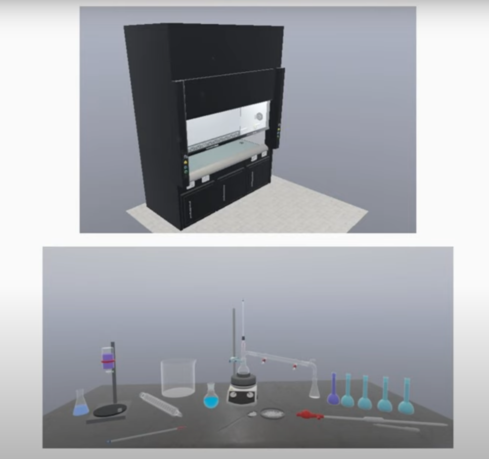
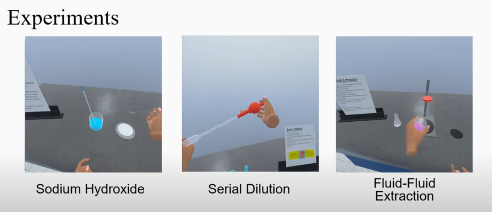

### Project Overview
This project aimed to bridge the gap between theoretical knowledge and practical lab skills by creating a **Digital Twin** of a fume cabinet from the university's wetlab. The goal was to develop an interactive and reusable VR training environment where students could practice and prepare for real-life experiments in a safe, virtual setting.

### My Role: Project Lead
For this project, I was responsible for **leading a small group of interns**. My role involved coordinating our efforts, managing the project timeline, and liaising with the **Wet Lab team** to ensure the scientific accuracy and pedagogical value of the simulation.

### Technical Implementation
Our development process involved a two-stage approach:
1.  **3D Asset Creation:** I used **Blender** to meticulously model a realistic, 1:1 scale digital twin of the fume cabinet and all associated lab equipment.
2.  **Interactive VR Development:** The 3D models were then imported into **Unity**. I utilized the **UltimateXR framework** to implement robust and intuitive VR interactions, allowing users to naturally pick up, manipulate, and use the virtual equipment.

### Outcome: An Interactive Training Module
The result is a high-fidelity VR simulation where students can learn and practice complex lab procedures. As an extension of the initial project, our team successfully implemented three core experiments chosen in coordination with the Wet Lab team:

This digital twin now serves as a powerful tool to enhance student confidence and competence before they even step foot in a physical laboratory.

---

**[Watch the Project Showcase Video &rarr;](https://youtu.be/286rEeMTwug?si=_diRP2aCZlJ4XPlE)**

