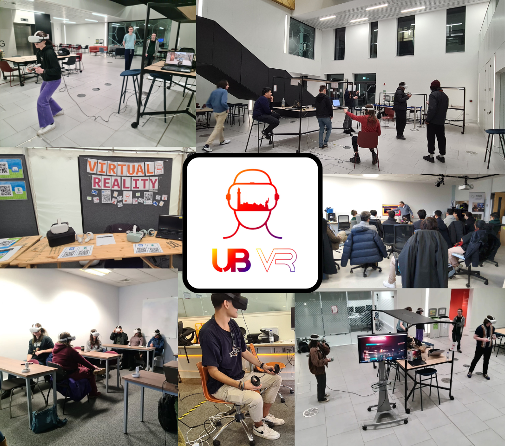

## Key Initiatives & Events

To grow an engaged community, I organised and hosted a series of events designed to lower the barrier to entry and inspire innovation:

* **Academic Speaker Series:** We hosted several talk sessions with university academics who shared their cutting-edge research and insights into the future of immersive technology.
* **Peer-to-Peer Learning:** A final-year student presented a detailed walkthrough of their VR dissertation project, providing a practical, step-by-step guide for students looking to start their own development projects.
* **Industry Connections:** We welcomed guest speakers from **Virtual Decisions**, a leading company in immersive training solutions. They provided invaluable insights into the commercial applications of VR and career pathways in the industry.

You can see a small example we've been able to do throughout the two years since we started in 2024!

---

## Strategic Collaborations

To provide members with access to resources and a wider network, we established key partnerships with:

* **The University of Birmingham VR Lab:** Giving students access to hardware and technical expertise at the dedicated lab at the School of Psychology.
* **BhamXR:** Connecting our members with the University's Research Group to foster development and connections.

---

## Impact and Outcomes

* Successfully created a thriving platform that has helped numerous students **get started in VR development**, providing them with foundational knowledge and a supportive peer network.
* Functioned as a key information hub, sharing valuable opportunities such as the **EdTech Internship at the Centre for Transformative Learning (CTL)**.

---

## Future Growth

To expand our horizons and connect our members with a national network of innovators, the society officially joined the **Intercollegiate VR Community (ICXR)** in August 2025. This move positions us to collaborate on larger projects and share knowledge with top XR student talent across the world. 🚀

